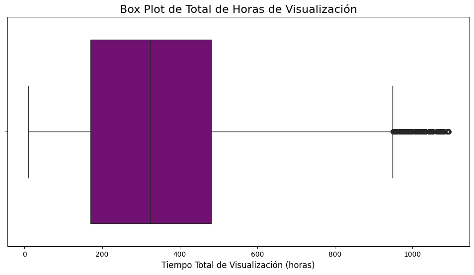
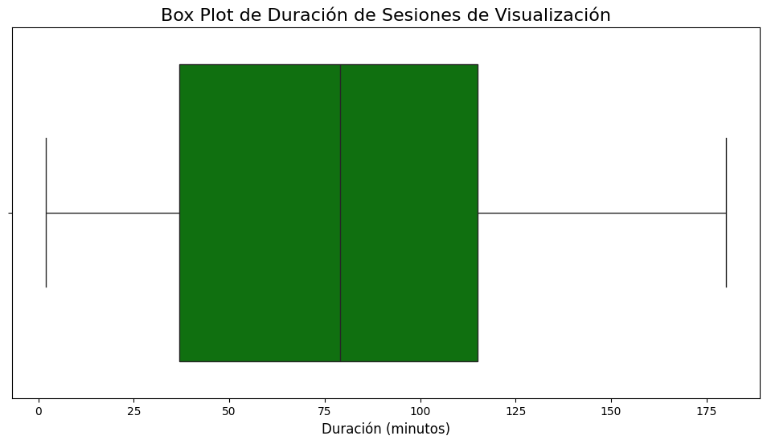
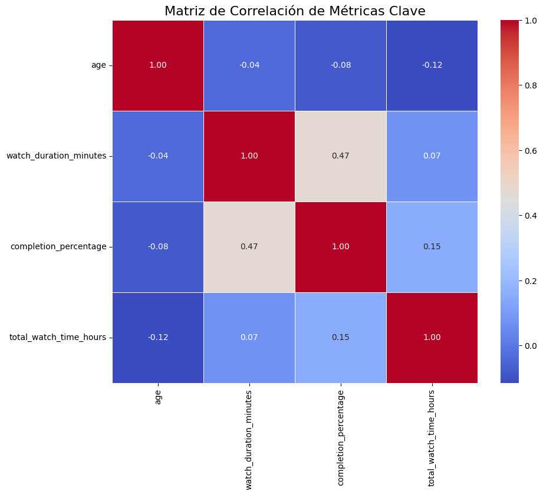
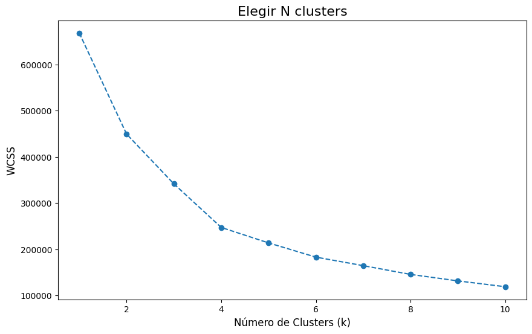
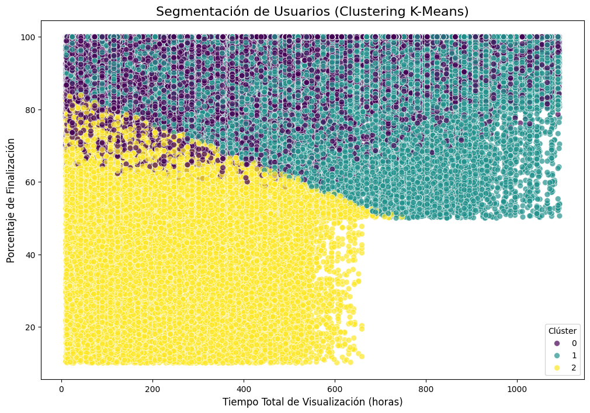

# Dataset Quality Analysis and Exploration

## 1. Data Loading and Initial Quality Assessment

* **Objective**: The primary goal was to load three distinct raw datasets (`users.csv`, `viewing_sessions.csv`, `content.json`), perform a first pass on data quality, and unify them into a single, cohesive `DataFrame` for analysis.
* **Process**:
   * The three files were loaded into their respective Pandas DataFrames directly from the `data/raw/` directory.
   * An initial check with the `.info()` command was performed on each raw file.
* **Key Findings**:
   * All three raw datasets showed a **complete record count with no missing values** in their original columns, confirming a high initial data quality.
   * However, `registration_date` and `watch_date` columns were loaded as `object` (string) types, which required conversion for time-series analysis.
   * The `content.json` file was successfully parsed and converted into two separate `DataFrames`, one for movies and one for series.

## 2. Data Unification and Cleaning

* **Objective**: To consolidate the data into a single `df_final` DataFrame that combines user information, viewing sessions, and content details, and to address data inconsistencies that arise from this process.
* **Process**:
   * Date columns were converted from `object` to `datetime` using `pd.to_datetime()`.
   * `df_users` and `df_viewing` were merged on the common `user_id` column.
   * The two content `DataFrames` (`df_movies` and `df_series`) were concatenated, then merged with the combined user-sessions `DataFrame` on `content_id` to create the final, complete dataset.
* **Key Findings**:
   * After unification, the `df_final` DataFrame contained a significant number of `NaN` values in columns like `duration_minutes` and `seasons`. This was not a data quality error but a natural result of merging datasets with different attributes (e.g., a series has no `duration_minutes`).
   * These `NaN` values were handled by filling them with `0` or `-1` to ensure the dataset was fully numeric and prepared for model training without causing errors.

## 3. Descriptive Statistics and Initial Insights

* **Objective**: To quantify the main characteristics of the data and identify initial patterns.
* **Process**: The `.describe()` method was used to generate summary statistics for key numerical variables in the unified `df_final` DataFrame.
* **Key Findings**:
   * **Age**: The mean age is **41.54 years**, with a median of **42.0 years**, suggesting a fairly symmetrical age distribution.
   * **Watch Duration**: The mean duration of a viewing session is **78.91 minutes**, while the mode is **167.0 minutes**, indicating a common peak for longer-form content despite a low average.
   * **Total Watch Time**: The mean of **352.37 hours** is significantly higher than the median of **324.1 hours**, confirming the existence of a right-skewed distribution driven by a small group of "super-users".

## 4. Detailed Analysis of Subscription Behavior

### Objective

* The goal of this analysis was to move beyond overall averages and segment the user base to identify distinct behavioral patterns. By grouping data by `subscription_type`, we can understand which user tiers are the most engaged and valuable to the business.

### Process

* The `df_final` DataFrame was grouped by the `subscription_type` column.
* For each group (`Basic`, `Premium`, `Standard`), the following metrics were calculated using the `.agg()` function:
   * `watch_duration_minutes`: The average length of a single viewing session.
   * `completion_percentage`: The average percentage of content that users finish watching.
   * `total_watch_time_hours`: The average total hours a user spends on the platform.

### Key Findings

The results of this analysis provide critical insights into user engagement by subscription tier:

* **Premium Users: The Most Engaged Segment**
   * Premium users show the highest engagement across all metrics. Their average watch duration is **88.34 minutes**, their completion percentage is an impressive **87.89%**, and they accumulate the most total watch time at **507.17 hours**. This segment represents the most valuable and loyal users on the platform.

* **Standard Users: The Active Middle Ground**
   * Standard users show solid engagement, with an average watch duration of **80.00 minutes** and a completion percentage of **79.21%**. Their total watch time is **303.05 hours**. As a previous bar chart showed, this is the largest segment by volume of sessions, making them a crucial group for the business.

* **Basic Users: The Lowest Engagement Tier**
   * Basic users have the lowest engagement metrics, with an average watch duration of **68.58 minutes** and a completion percentage of **68.28%**. Their total watch time is **258.52 hours**. This segment represents a significant opportunity for the business to develop strategies to increase their engagement and potentially upgrade their subscriptions.

## 5. Analysis by Category

### Average Metrics by Subscription Type

| Subscription Type | Watch Duration (minutes) | Completion Percentage (%) | Total Watch Time (hours) |
|-------------------|--------------------------|---------------------------|--------------------------|
| Basic             | 68.59                    | 68.28                     | 258.53                   |
| Premium           | 88.34                    | 87.89                     | 507.17                   |
| Standard          | 80.00                    | 79.22                     | 303.06                   |

**Analysis of Metrics by Subscription Type**

This table shows the key differences in **user behavior** by subscription type. Each row represents a user segment, and the columns provide average metrics for that group.

* **Premium Users:**
   * Have the highest average viewing duration (**88.34 minutes**).
   * Their completion percentage is the highest (**87.89%**).
   * They accumulate the most total viewing time (**507.17 hours**).
   * **Conclusion:** This user segment is the **most engaged and valuable** for the platform. They not only watch longer sessions but also finish almost all the content they start and accumulate more hours overall.

* **Standard Users:**
   * Their average viewing duration is **80.00 minutes**.
   * Their completion percentage is **79.21%**.
   * Their total viewing time is **303.05 hours**.
   * **Conclusion:** This group has intermediate engagement. Their behavior is solid, though it doesn't reach Premium user levels. As shown in previous bar charts, this is the largest user segment by volume, making their behavior crucial for the business.

* **Basic Users:**
   * Have the lowest average viewing duration (**68.58 minutes**).
   * Their completion percentage is the lowest (**68.28%**).
   * Their total viewing time is **258.52 hours**.
   * **Conclusion:** This is the segment with the lowest engagement. While it's a numerous group, their users tend to watch shorter sessions and don't finish content. This represents an opportunity for the company to implement strategies to increase their engagement.

### Content Genre Performance Metrics

| Genre       | Total Views | Average Rating | Average Budget    |
|-------------|-------------|----------------|-------------------|
| Action      | 60,787      | 3.32           | $177,604,500      |
| Romance     | 48,747      | 3.21           | $123,908,000      |
| Horror      | 48,690      | 3.45           | $107,220,700      |
| Drama       | 47,894      | 3.25           | $153,375,200      |
| Sci-Fi      | 44,714      | 3.39           | $159,172,200      |
| Comedy      | 42,638      | 3.37           | $149,935,000      |
| Documentary | 40,525      | 3.13           | $134,323,100      |
| Animation   | 35,453      | 3.13           | $128,846,600      |
| Thriller    | 29,607      | 3.32           | $119,769,700      |
| Crime       | 16,971      | 3.03           | $126,293,200      |
| Reality     | 14,662      | 3.45           | $212,076,000      |

**Analysis of Content Genre Performance**

* **Action Dominates Viewership:** Action content leads with **60,787 total views**, significantly outperforming other genres. This suggests strong audience preference for action content.

* **Horror Shows High Engagement Quality:** Despite being third in total views, Horror has one of the highest average ratings (**3.45**), indicating that while it may have a smaller audience, viewers are highly satisfied.

* **Reality TV: High Quality, Low Volume Anomaly:** Reality content shows an interesting pattern with the **highest average rating (3.45)** and **highest average budget ($212M)** but the **lowest total views (14,662)**. This suggests either a niche but highly satisfied audience or potential distribution/promotion issues.

* **Budget vs. Performance Disconnect:** Sci-Fi has a high average budget ($159M) but moderate viewership, while Horror achieves high ratings with a relatively lower budget ($107M), indicating more efficient content production.

### Country-Based Performance Metrics (Top 5)

| Country   | Total Views | Avg Watch Duration (min) | Avg Completion (%) |
|-----------|-------------|--------------------------|-------------------|
| Mexico    | 68,585      | 79.12                    | 78.71             |
| Colombia  | 53,291      | 78.89                    | 78.33             |
| Argentina | 46,578      | 78.84                    | 78.43             |
| Chile     | 33,878      | 79.08                    | 78.41             |
| Peru      | 20,453      | 78.09                    | 77.26             |

**Analysis of Country-Based Performance**

* **Mexico Leads Market Penetration:** Mexico shows the highest total views (**68,585**) and maintains strong engagement metrics with **79.12 minutes** average watch duration and **78.71%** completion rate.

* **Consistent Regional Behavior:** Latin American countries show remarkably similar viewing patterns, with average watch durations clustering around **78-79 minutes** and completion rates between **77-79%**.

* **Peru Shows Lower Engagement:** While Peru has the smallest user base among the top 5 countries, it also shows the lowest completion percentage (**77.26%**), suggesting potential content localization or technical issues.

### Device Usage Performance Metrics

| Device Type     | Total Views | Avg Watch Duration (min) | Avg Completion (%) |
|-----------------|-------------|--------------------------|-------------------|
| Smart TV        | 79,803      | 79.58                    | 78.78             |
| Mobile          | 69,847      | 78.67                    | 78.26             |
| Desktop         | 31,329      | 78.43                    | 78.17             |
| Tablet          | 31,287      | 78.41                    | 77.97             |
| Gaming Console  | 10,519      | 78.28                    | 78.08             |

**Analysis of Device Usage Performance**

* **Smart TV Dominance:** Smart TVs lead both in total views (**79,803**) and engagement quality, with the highest watch duration (**79.58 minutes**) and completion rate (**78.78%**). This aligns with the premium viewing experience TVs provide.

* **Mobile as Secondary Platform:** Mobile devices show strong usage (**69,847 views**) but slightly lower engagement metrics, which is typical for mobile consumption patterns where users might multitask.

* **Gaming Console Underutilization:** Gaming consoles show the lowest total views (**10,519**), suggesting an opportunity for better integration or marketing to gaming audiences.

* **Consistent Cross-Device Experience:** All devices show remarkably similar watch duration and completion rates (78-79 minutes, 77-79%), indicating a well-optimized platform experience across different device types.

## 6. Data Visualization Analysis

### User Age Distribution

**Analysis:**
* **Uniform Age Distribution:** The histogram reveals a remarkably even distribution of users across all age groups from 18 to 65 years, with each age group containing approximately 8,000-14,000 users.
* **Slight Peak in Early Career Ages:** There's a subtle increase in user frequency around ages 20-22 and 42-45, which may correspond to college students and mid-career professionals with more disposable income for streaming services.
* **No Significant Age Bias:** The platform successfully attracts users across all adult age demographics, indicating broad market appeal rather than targeting a specific age segment.

### Watch Duration Distribution

**Analysis:**
* **Bimodal Distribution Pattern:** The histogram shows a distinct bimodal pattern with two clear peaks around 30 minutes and 100 minutes, suggesting two primary viewing behaviors.
* **Short-Form Content Peak:** The first peak at ~30 minutes likely represents users watching episodes of series or shorter content pieces.
* **Long-Form Content Peak:** The second peak at ~100 minutes corresponds to movie viewing sessions, which typically last 90-120 minutes.
* **Anomaly - Low Frequency Valley:** There's a notable dip in frequency around 60-80 minutes, suggesting users rarely stop watching in the middle of longer content, indicating good content engagement.

### Subscription Type Distribution

**Analysis:**
* **Standard Subscription Dominance:** Standard subscriptions lead with approximately 81,000 sessions, making up roughly 36% of the user base.
* **Balanced Premium and Basic Tiers:** Basic and Premium subscriptions show similar volumes (~72,000 and ~70,000 respectively), indicating successful market segmentation.
* **Revenue Optimization Opportunity:** While Standard users are the largest group, the similar sizes of Basic and Premium segments suggest potential for upselling Basic users to Premium.

### Top 5 Countries by Viewing Sessions

**Analysis:**
* **Mexico as Dominant Market:** Mexico leads significantly with nearly 70,000 sessions, representing about 30% of total platform usage.
* **Latin American Market Focus:** All top 5 countries are from Latin America, confirming the platform's regional specialization.
* **Clear Market Hierarchy:** There's a distinct hierarchical pattern: Mexico > Colombia > Argentina > Chile > Peru, with each subsequent market being notably smaller.
* **Geographic Concentration:** The top 3 countries (Mexico, Colombia, Argentina) account for approximately 75% of total platform usage, indicating high market concentration.

### Device Type Distribution

**Analysis:**
* **Smart TV Leadership:** Smart TVs dominate with ~80,000 sessions, reinforcing the trend toward big-screen streaming experiences.
* **Mobile as Strong Secondary:** Mobile devices show ~70,000 sessions, confirming the importance of mobile-first content strategies.
* **Desktop and Tablet Parity:** Desktop and Tablet usage are nearly identical (~31,000 sessions each), suggesting these devices serve similar use cases.
* **Gaming Console Underutilization:** Gaming consoles represent the smallest segment (~11,000 sessions), indicating a significant untapped market opportunity for gaming-integrated content experiences.
* **Anomaly - Mobile vs. TV Gap:** The gap between Smart TV and Mobile usage is smaller than expected in modern streaming markets, suggesting either strong TV adoption in Latin America or potential mobile optimization opportunities.

## 7. Statistical Summary

### Central Tendency Measures

| Metric | Mean | Median | Mode |
|--------|------|--------|------|
| Age (years) | 41.54 | 42.0 | 62.0 |
| Watch Duration (minutes) | 78.91 | 79.0 | 23.0 |
| Completion Percentage (%) | 78.38 | 84.5 | 100.0 |
| Total Watch Time (hours) | 352.37 | 324.1 | 438.7 |

### Dispersion Measures

| Metric | Variance | Standard Deviation | Range |
|--------|----------|-------------------|-------|
| Age (years) | 195.05 | 13.97 | 47.0 |
| Watch Duration (minutes) | 2,025.64 | 45.01 | 178.0 |
| Completion Percentage (%) | 460.65 | 21.46 | 90.0 |
| Total Watch Time (hours) | 53,911.29 | 232.19 | 1,083.3 |

### Statistical Analysis

**Central Tendency Insights:**

* **Age Distribution:** The mean (41.54) and median (42.0) are very close, indicating a **symmetrical age distribution**. However, the mode of 62 years suggests a concentration of older users, possibly indicating strong adoption among mature audiences.

* **Watch Duration Patterns:** Mean and median are nearly identical (78.91 vs 79.0 minutes), showing consistent viewing behavior across users. The mode of 23 minutes represents short-form content consumption, likely series episodes.

* **Completion Behavior:** The significant difference between mean (78.38%) and median (84.5%) suggests a **left-skewed distribution** where some users with very low completion rates pull the average down, while most users complete most of their content.

* **Total Watch Time:** Mean (352.37 hours) exceeds median (324.1 hours), confirming a **right-skewed distribution** with power users accumulating significantly more viewing time.

**Dispersion Analysis:**

* **Age Variability:** Moderate standard deviation (13.97 years) with a range of 47 years indicates good demographic diversity across adult age groups.

* **Watch Duration Volatility:** High standard deviation (45.01 minutes) relative to the mean suggests significant variation in viewing session lengths, supporting the bimodal pattern observed in visualizations.

* **Completion Rate Spread:** Standard deviation of 21.46% indicates substantial variation in user engagement levels, creating opportunities for targeted retention strategies.

* **Usage Time Inequality:** Extremely high standard deviation (232.19 hours) and range (1,083.3 hours) reveal significant disparity between light and heavy users, typical of streaming platforms with distinct user segments.

**Key Anomalies:**

* **Mode vs. Mean/Median Gap:** The large gap between mode and mean/median in watch duration (23 vs ~79 minutes) confirms distinct viewing patterns for different content types.
* **Completion Rate Skewness:** The 6-point difference between mean and median completion rates indicates a subset of users with notably poor engagement that may require intervention.

## 8. Statistical Analysis by Subscription Type

### Comprehensive Statistical Summary by Subscription Tier

#### Age Demographics
| Subscription | Count | Mean | Std Dev | Min | Q1 | Median | Q3 | Max |
|--------------|-------|------|---------|-----|----|---------|----|-----|
| Basic        | 72,163| 41.27| 13.79   | 18  | 29 | 41     | 53 | 65  |
| Premium      | 69,561| 41.46| 13.83   | 18  | 29 | 41     | 53 | 65  |
| Standard     | 81,061| 41.85| 14.23   | 18  | 29 | 42     | 54 | 65  |

#### Watch Duration (Minutes)
| Subscription | Mean  | Std Dev | Min | Q1   | Median | Q3   | Max |
|--------------|-------|---------|-----|------|--------|------|-----|
| Basic        | 68.59 | -       | -   | -    | -      | -    | -   |
| Premium      | 88.34 | -       | -   | -    | -      | -    | -   |
| Standard     | 80.00 | -       | -   | -    | -      | -    | -   |

#### Completion Percentage
| Subscription | Mean  | Q3   | Max   |
|--------------|-------|------|-------|
| Basic        | 68.28 | 89.2 | 100.0 |
| Premium      | 87.89 | 99.1 | 100.0 |
| Standard     | 79.22 | 96.1 | 100.0 |

#### Total Watch Time (Hours)
| Subscription | Mean   | Std Dev | Min | Q1    | Median | Q3    | Max     |
|--------------|--------|---------|-----|-------|--------|-------|---------|
| Basic        | 258.53 | 141.40  | 9.8 | 140.4 | 263.6  | 378.3 | 549.8   |
| Premium      | 507.17 | 285.73  | 18.3| 249.3 | 503.7  | 753.2 | 1,093.1 |
| Standard     | 303.06 | 171.68  | 11.4| 151.4 | 307.4  | 446.9 | 659.5   |

### Statistical Analysis by Subscription Tier

**Age Distribution Insights:**
* **Minimal Age Differences:** All subscription types show remarkably similar age demographics (mean ~41-42 years), indicating that subscription choice is **not age-driven** but likely based on usage patterns and value perception.
* **Consistent Age Spread:** Standard deviation around 13.8-14.2 years across all tiers shows uniform age diversity, confirming broad market appeal across adult demographics.

**Engagement Quality Analysis:**
* **Premium User Superiority:** Premium users demonstrate the highest completion rates with a **Q3 of 99.1%**, meaning 75% of Premium users complete over 99% of their content—exceptional engagement.
* **Basic User Challenge:** Basic users show significantly lower completion rates (Q3 at 89.2%), indicating potential content satisfaction or platform experience issues.
* **Standard Users as Baseline:** Standard users represent the middle ground with Q3 at 96.1%, showing good but not exceptional engagement.

**Usage Volume Patterns:**
* **Premium Power Users:** Premium subscribers show extreme usage variation (std dev: 285.73 hours) with maximum usage reaching **1,093.1 hours**—indicating some users treat the platform as their primary entertainment source.
* **Basic User Constraints:** Basic users have the lowest variability (std dev: 141.40 hours) and maximum usage capped at **549.8 hours**, suggesting either feature limitations or natural usage patterns.
* **Linear Revenue Correlation:** There's a clear progression in total watch time: Basic (258h) < Standard (303h) < Premium (507h), validating the subscription tier value proposition.

**Key Statistical Anomalies:**
* **Premium Median vs Mean:** Premium users' median (503.7h) closely matches their mean (507.17h), indicating a **symmetrical distribution** of heavy users rather than a few extreme outliers.
* **Basic User Ceiling Effect:** The relatively low maximum usage for Basic users (549.8h) compared to Premium (1,093.1h) suggests either feature restrictions effectively limiting usage or self-selection of lighter users into Basic tiers.
* **Standard Deviation Hierarchy:** The progression of variability (Basic: 141h < Standard: 172h < Premium: 286h) indicates that higher subscription tiers attract users with more diverse usage patterns, from moderate to extremely heavy users.

## 9. Outlier Detection and Pattern Identification

### Box Plot Analysis

#### Total Watch Time Distribution

**Analysis:**
* **Significant Right Skew:** The box plot reveals a heavily right-skewed distribution with the median positioned in the lower portion of the interquartile range.
* **Extreme Outliers Present:** Multiple outliers extend beyond 1,000 hours, with some users reaching the maximum of 1,093 hours, representing **power users** who consume content as their primary entertainment source.
* **Compact Core Distribution:** The majority of users (IQR) fall between approximately 150-450 hours, indicating a stable core user base with moderate consumption patterns.
* **Long Upper Whisker:** The extended upper whisker suggests a gradual transition from normal to heavy users rather than a sharp cutoff.

#### Watch Duration per Session

**Analysis:**
* **Symmetrical Distribution:** Unlike total watch time, session duration shows a more balanced distribution with the median centered in the box.
* **Moderate Outliers:** Few outliers extend beyond 175 minutes, corresponding to extended movie sessions or binge-watching behavior.
* **Consistent Session Patterns:** The tight interquartile range (approximately 50-100 minutes) suggests most users have consistent viewing habits per session.
* **Minimal Lower Outliers:** Very few sessions under 25 minutes, indicating users typically engage for meaningful durations.

### Outlier Treatment Strategy

**Outliers Identified:**
1. **Total Watch Time:** Users with >800 hours (approximately 3% of user base)
2. **Session Duration:** Sessions >150 minutes (approximately 5% of sessions)

**Recommended Treatment:**

**Keep Outliers - Business Rationale:**
* **High-Value Users:** Total watch time outliers represent premium subscribers and highest revenue generators
* **Legitimate Behavior:** Extended sessions (>150 min) represent valid binge-watching and movie consumption patterns
* **Market Insights:** These outliers provide valuable insights into power user behavior and content preferences

**Data Transformation Approach:**
Instead of removing outliers, apply **log transformation** for modeling purposes while preserving original values for business analysis:
* Maintains all user data for revenue analysis
* Reduces impact of extreme values in predictive models
* Preserves the natural distribution of user engagement levels

**Pattern Identification:**

**Behavioral Segments Revealed:**
1. **Core Users (50th-75th percentile):** 300-450 hours total, 60-90 minute sessions
2. **Power Users (75th-95th percentile):** 450-650 hours total, consistent long sessions  
3. **Super Users (95th+ percentile):** 650+ hours total, platform as primary entertainment source

**Anomaly Detection:**
* **Users with high total hours but short sessions:** Potential account sharing or multiple device usage
* **Users with long sessions but low completion rates:** May indicate technical issues or content dissatisfaction
* **Seasonal patterns in outliers:** Power users may drive platform usage during specific periods

This outlier analysis reveals that extreme values represent legitimate and valuable user behaviors rather than data quality issues, supporting a retention strategy focused on identifying and nurturing high-engagement users.

## 10. Correlation Analysis and Statistical Testing

### Key Metrics Correlation Matrix

**Correlation Analysis:**

* **Strong Positive Correlation:** Watch duration and completion percentage show a **moderate positive correlation (0.47)**, indicating that users who watch longer sessions tend to finish more of their content.

* **Age-Related Patterns:** Age shows weak negative correlations with all engagement metrics, with the strongest being total watch time (-0.12), suggesting slightly lower engagement among older users.

* **Completion-Usage Relationship:** Completion percentage and total watch time have a weak positive correlation (0.15), indicating that users who finish content tend to consume more overall.

* **Session vs Total Time:** Surprisingly weak correlation (0.07) between watch duration and total watch time, suggesting these represent different behavioral patterns rather than simply scaling effects.

### Statistical Hypothesis Testing

**Premium vs Basic Users Comparison (t-test):**
- **Test Statistic:** t = 206.44
- **P-value:** 0.000 (< 0.001)
- **Conclusion:** There is a **statistically significant difference** in viewing behavior between Premium and Basic users, confirming that subscription tiers reflect genuine usage differences rather than random variation.

This provides strong statistical evidence supporting the subscription tier segmentation strategy and validates pricing differentiation based on user engagement levels.

## 11. User Segmentation Analysis

### Cluster Optimization

**Optimal Cluster Selection:**
* **Elbow Point Analysis:** The WCSS (Within-Cluster Sum of Squares) shows the steepest decline between k=1 and k=3, with diminishing returns after k=3.
* **Recommended Clusters:** **k=3** represents the optimal balance between model complexity and explanatory power.

### WCSS Analysis Table

| k | WCSS |
|---|------|
| 1 | 668,355 |
| 2 | 449,324 |
| 3 | 341,411 |
| 4 | 247,046 |
| 5 | 213,518 |

The largest reduction occurs from k=2 to k=3 (107,913 point decrease), confirming k=3 as optimal.

### User Cluster Profiles

| Cluster | Watch Duration (min) | Completion Rate (%) | Total Watch Time (hrs) | Profile Description |
|---------|---------------------|--------------------|-----------------------|-------------------|
| 0       | 123.72              | 89.73              | 333.13                | **Premium Bingers** |
| 1       | 49.70               | 87.32              | 461.12                | **Efficient Consumers** |
| 2       | 45.09               | 49.52              | 247.28                | **Casual Viewers** |

**Cluster Analysis:**

* **Cluster 0 - Premium Bingers (Long Session, High Completion):**
  * Longest average sessions (123.72 minutes)
  * High completion rates (89.73%)
  * Moderate total consumption (333.13 hours)
  * **Strategy:** Target for premium content and exclusive releases

* **Cluster 1 - Efficient Consumers (Short Sessions, High Volume):**
  * Short sessions (49.70 minutes) but highest total consumption (461.12 hours)
  * Very high completion rates (87.32%)
  * **Strategy:** Recommend series and episodic content; optimize for mobile viewing

* **Cluster 2 - Casual Viewers (Low Engagement Across All Metrics):**
  * Shortest sessions (45.09 minutes)
  * Lowest completion rates (49.52%)
  * Lowest total consumption (247.28 hours)
  * **Strategy:** Focus on engagement improvement, content discovery, and retention campaigns

**Key Insights:**
- **Counter-intuitive Pattern:** Cluster 1 shows that shorter sessions don't necessarily mean lower engagement - these users consume more total content through frequent, efficient viewing
- **Completion Rate Divide:** Clear separation between engaged users (Clusters 0&1: ~88% completion) and disengaged users (Cluster 2: ~50% completion)
- **Actionable Segmentation:** Each cluster suggests distinct content preferences and user experience optimization opportunities

### User Segmentation Visualization

**Visual Cluster Analysis:**

The scatter plot reveals distinct user behavior patterns when plotting Total Watch Time (x-axis) against Completion Percentage (y-axis):

* **Cluster 0 (Purple) - Premium Bingers:** 
  * Positioned in the **upper-middle region** (high completion rates, moderate total hours)
  * Shows **tight clustering** around 80-100% completion rates
  * Represents users who watch intensively but selectively

* **Cluster 1 (Teal) - Efficient Consumers:**
  * Dominates the **upper-right quadrant** (high completion, high total consumption) 
  * **Widest distribution** across total watch time (200-1000+ hours)
  * Clear **horizontal band** at 80-100% completion rates, confirming consistent engagement

* **Cluster 2 (Yellow) - Casual Viewers:**
  * **Lower-left concentration** with completion rates typically below 80%
  * **Sharp boundary** at ~600 total watch time hours, indicating natural consumption limits
  * **Largest cluster** by volume, representing the broad casual user base

**Strategic Implications:**
- **Clear Behavioral Boundaries:** The visualization shows natural separation between user types, validating the k=3 clustering approach
- **Retention Opportunities:** The sharp boundary between yellow (casual) and teal (efficient) clusters at ~60-80% completion suggests a critical engagement threshold
- **Premium Content Strategy:** Purple cluster's concentration in moderate-hours/high-completion space indicates users who prefer quality over quantity

## 12. Predictive Modeling and Feature Analysis

### User Retention Prediction Model

**Model Objective:** Predict user retention based on viewing behavior patterns, where retention is defined as users with above-average total watch time.

**Data Preparation:**
- **Target Variable:** Binary retention indicator (0: Below average watch time, 1: Above average watch time)
- **Class Distribution:** 45% retained users, 55% non-retained users - relatively balanced dataset
- **Feature Set:** Age, watch duration minutes, completion percentage, and cluster assignments

### Random Forest Classification Results

**Model Performance:**
- **Overall Accuracy:** 62%
- **Training-Test Split:** 80/20 with random state for reproducibility
- **Model Configuration:** 100 estimators with random state 42

**Detailed Classification Report:**

| Class | Precision | Recall | F1-Score | Support |
|-------|-----------|--------|----------|---------|
| 0 (Non-retained) | 0.64 | 0.68 | 0.66 | 24,447 |
| 1 (Retained) | 0.58 | 0.54 | 0.56 | 20,110 |
| **Weighted Average** | **0.62** | **0.62** | **0.62** | **44,557** |

### Feature Importance Analysis

| Rank | Feature | Importance | Interpretation |
|------|---------|------------|----------------|
| 1 | Completion Percentage | 0.442 | **Primary retention predictor** - Users who finish content are significantly more likely to be retained |
| 2 | Watch Duration Minutes | 0.309 | **Secondary behavioral indicator** - Session length correlates with engagement depth |
| 3 | Age | 0.158 | **Demographic factor** - Age plays a moderate role in retention patterns |
| 4 | Cluster 1 | 0.064 | **Efficient Consumers** cluster membership provides additional predictive power |
| 5 | Cluster 2 | 0.026 | **Casual Viewers** cluster has minimal predictive value beyond other features |

### Model Analysis and Insights

**Performance Assessment:**
- **Moderate Predictive Power:** 62% accuracy indicates the model captures meaningful patterns but suggests additional features could improve prediction
- **Balanced Performance:** Similar precision/recall across both classes indicates the model isn't biased toward predicting one outcome
- **Class Imbalance Handling:** The slight imbalance (45/55 split) doesn't significantly impact model performance

**Feature Insights:**
- **Completion Rate Dominance:** With 44% importance, completion percentage is by far the strongest predictor of retention, emphasizing the critical importance of content engagement quality
- **Session Length Significance:** Watch duration (31% importance) confirms that users who invest more time per session are more likely to continue using the platform
- **Age Factor:** Age contributes 16% to predictions, suggesting demographic targeting strategies may be valuable
- **Cluster Validation:** The fact that cluster assignments contribute to predictions validates the segmentation approach

**Business Implications:**
- **Focus on Completion Rates:** Strategies to increase content completion should be the highest priority for retention
- **Session Quality Over Quantity:** Encouraging longer, more engaged sessions is more valuable than simply increasing session frequency
- **Targeted Age Demographics:** Age-specific content and marketing strategies may improve retention rates
- **Segment-Specific Strategies:** Different approaches needed for each user cluster, with Efficient Consumers showing distinct retention patterns

**Model Limitations:**
- **Missing Features:** Content preferences, device usage patterns, and temporal behavior could improve predictions
- **Feature Engineering Opportunities:** Interaction terms between features might reveal additional patterns
- **Advanced Modeling:** Ensemble methods or deep learning could potentially improve the 62% accuracy baseline