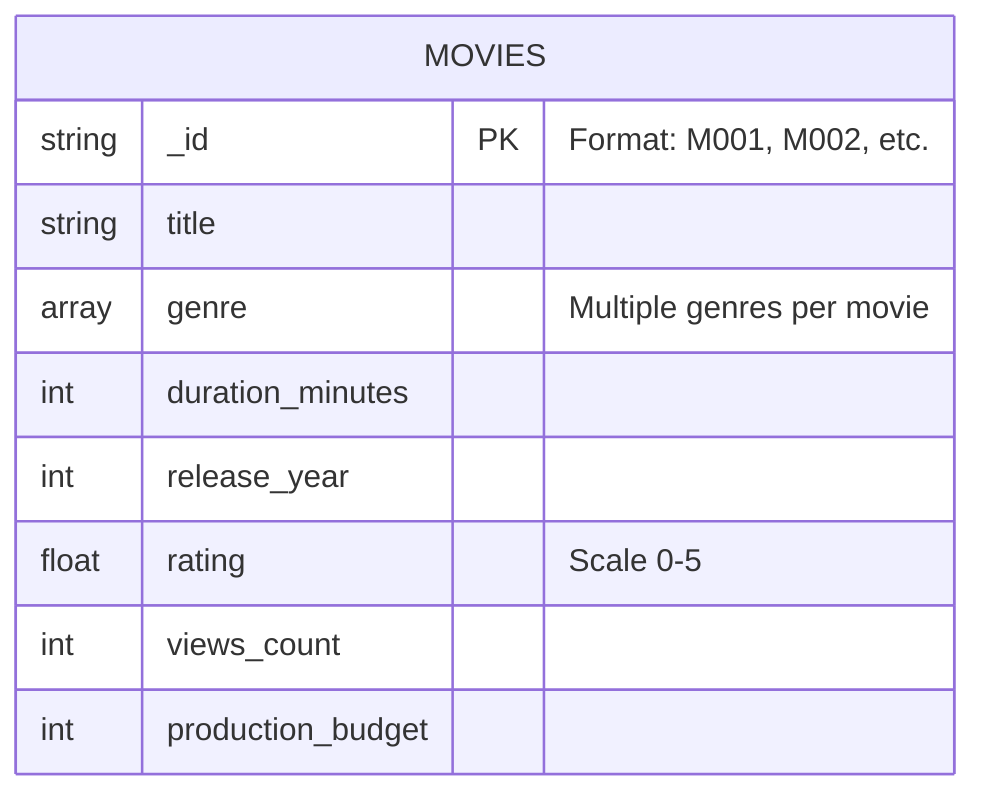
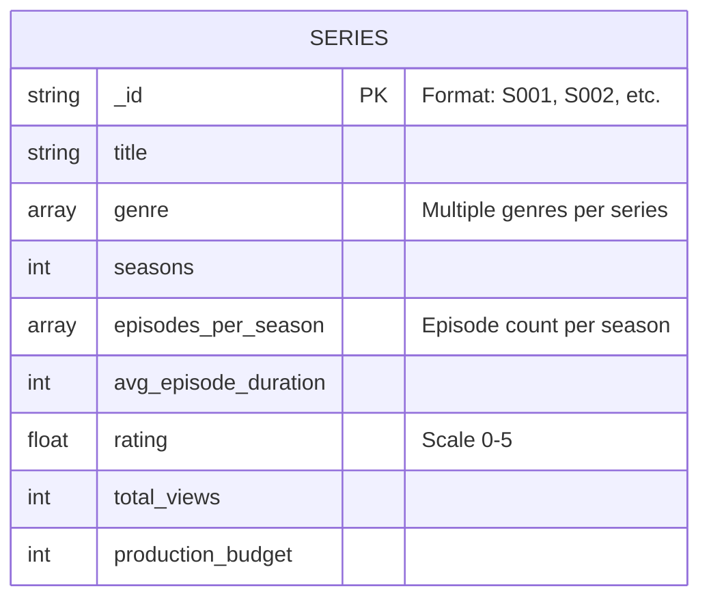
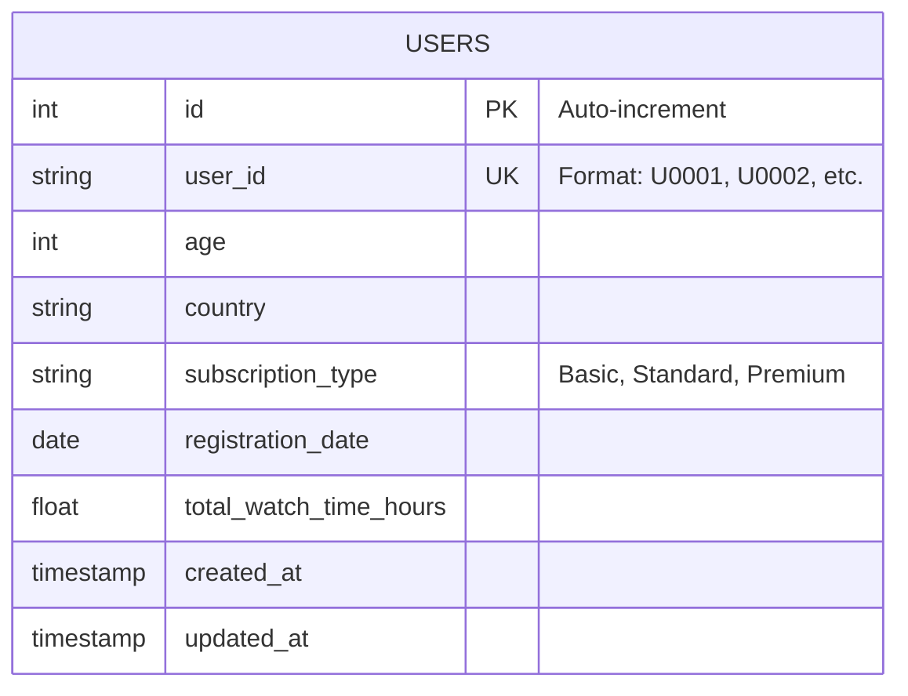
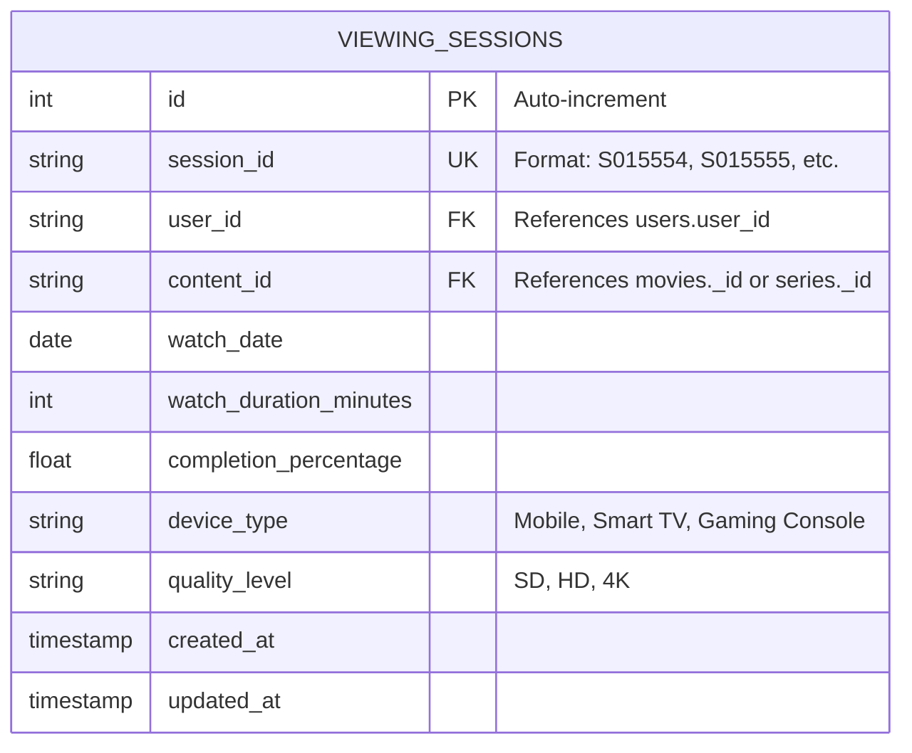
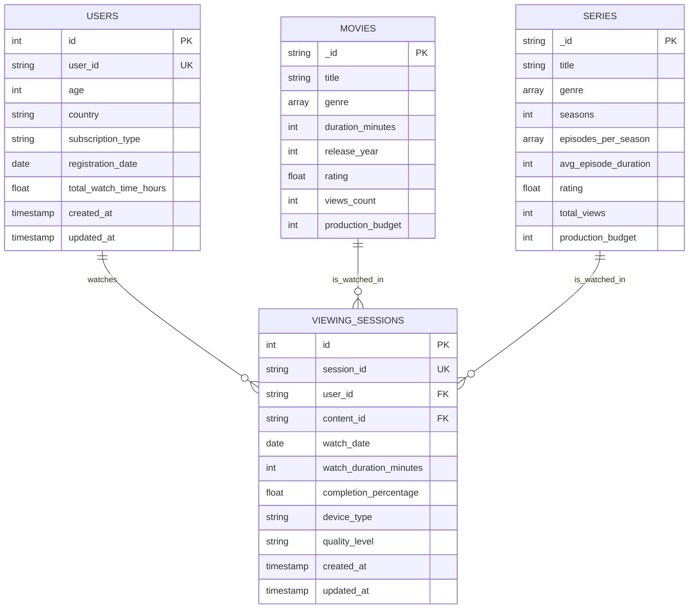

# visualization-tools-IX

## Objective
To design, implement, and deploy a multi-service data engineering solution that analyzes simulated video streaming data and presents key insights via an interactive dashboard, fulfilling all project and portfolio requirements for the "Visual Modeling" course.

## Microservices

### [(Public) API](./API/README.md)

### [(Public) Web](./Web/README.md)
 
### [(Private) Generator](./Generator/README.md)

### [(Private) Inyector](./Inyector/README.md)

### [(Private) ML](./ML/README.md)
 
### (Private) Databse Architecture

This project implements a **hybrid database architecture** that combines both NoSQL (MongoDB) and SQL (PostgreSQL) databases to optimize data storage based on the nature and structure of each dataset.

#### Database Selection Rationale

##### MongoDB (NoSQL)
Used for storing **semi-structured content metadata** that benefits from flexible schemas:
- **Movies Collection**: Stores movie metadata with variable genre arrays
- **Series Collection**: Stores series metadata with nested episode information per season

**Why MongoDB?**
- Flexible schema allows easy addition of new fields without migrations
- Native support for array fields (genres, episodes per season)
- Optimized for read-heavy operations common in content catalogs
- JSON-like documents match the natural structure of content metadata

##### PostgreSQL (SQL)
Used for storing **structured relational data** with well-defined relationships:
- **Users Table**: User profiles with subscription information
- **Viewing Sessions Table**: User activity logs with foreign key relationships

**Why PostgreSQL?**
- ACID compliance ensures data integrity for user transactions
- Strong support for complex queries and aggregations
- Referential integrity through foreign keys
- Optimized for analytical queries on viewing patterns

#### Entity-Relationship Diagrams

##### MongoDB Collections

###### Movies Collection

**Key Characteristics:**
- Primary Key: `_id` (string format: M###)
- Genre stored as array for flexibility
- Denormalized structure optimized for read performance

###### Series Collection

**Key Characteristics:**
- Primary Key: `_id` (string format: S###)
- Nested array structure for episodes per season
- Self-contained documents with all series metadata

##### PostgreSQL Tables

###### Users Table

**Key Characteristics:**
- Primary Key: `id` (integer, auto-increment)
- Unique Key: `user_id` (used for external references)
- Audit fields: `created_at`, `updated_at`

###### Viewing Sessions Table

**Key Characteristics:**
- Primary Key: `id` (integer, auto-increment)
- Foreign Key: `user_id` → references `users.user_id`
- Foreign Key: `content_id` → references either `movies._id` or `series._id`
- Tracks user behavior and viewing metrics

##### Complete System Architecture

#### Cross-Database Relationships

The system implements a **polyglot persistence pattern** where relationships span across different database technologies:

##### Viewing Sessions Bridge
The `viewing_sessions` table acts as a **bridge** between PostgreSQL and MongoDB:

1. **User → Viewing Sessions** (PostgreSQL to PostgreSQL)
   - Relationship: One-to-Many
   - `users.user_id` → `viewing_sessions.user_id`
   - A user can have multiple viewing sessions

2. **Content → Viewing Sessions** (MongoDB to PostgreSQL)
   - Relationship: One-to-Many (logical, not enforced)
   - `movies._id` OR `series._id` → `viewing_sessions.content_id`
   - The same content can be watched in multiple sessions
   - **Note**: This is a logical relationship managed at the application level since MongoDB and PostgreSQL cannot enforce referential integrity across databases

##### Content Type Discrimination
The system uses a **prefix-based identification** to distinguish between movies and series:
- Movie IDs start with `M` (e.g., M001, M139, M065)
- Series IDs start with `S` (e.g., S001, S014)

This allows the application layer to route queries to the appropriate database based on the `content_id` prefix.

#### Important Notes

1. **No Foreign Key Enforcement Across Databases**
   - The relationship between `viewing_sessions.content_id` and MongoDB collections (`movies._id`, `series._id`) is **logical only**
   - Application-level validation is required to maintain referential integrity
   - The API service is responsible for ensuring valid content_id values

2. **Denormalization in MongoDB**
   - Content metadata is intentionally denormalized for read performance
   - Duplicate titles across different series (e.g., "The Investigators" in the sample data) are allowed
   - This is acceptable in a content catalog where reads vastly outnumber writes

3. **Scalability Considerations**
   - MongoDB collections can scale horizontally through sharding
   - PostgreSQL can be optimized with indexing on `user_id` and `content_id`
   - Consider partitioning `viewing_sessions` by date for large datasets

4. **Data Consistency**
   - Use transactions in PostgreSQL for user-related operations
   - MongoDB operations are atomic at the document level
   - Cross-database operations require eventual consistency patterns

5. **Query Optimization**
   - Index `viewing_sessions.user_id` for user activity queries
   - Index `viewing_sessions.content_id` for content popularity analytics
   - Create compound indexes for common query patterns (e.g., user_id + watch_date)

## Environment

### Variables

It is needed to have a `.env` file with the following

| Variable | Example | Container |
| -------- | ------- | --------- |
| MONGO_URL | mongodb://mongo_visualization:27017 | mongo_visualization |
| MONGO_DB | visualization_db | mongo_visualization |
| MONGO_ROOT_USER | admin | mongo_visualization |
| MONGO_ROOT_PASSWORD | admin123 | mongo_visualization |
| MONGO_USER | admin | mongo_visualization |
| MONGO_PASSWORD | admin123 | mongo_visualization |
| POSTGRES_HOST | postgres_visualization | postgres_visualization |
| POSTGRES_PORT | 5432 | postgres_visualization |
| POSTGRES_DB | visualization_db | postgres_visualization |
| POSTGRES_USER | admin | postgres_visualization |
| POSTGRES_PASSWORD | admin123 | postgres_visualization |
| URL_API | http://0.0.0.0:503 | web_visualization, gen_visualization, inyector_visualization |

## Execution

The only requirement is that `Docker` and `docker compose` must be installed in the OS.

### docker-compose

To execute from the **docker-compose.yml**, you must be located in the `/visualization-tools-IX/` folder.

| Command | Purpose |
| ------- | ------- |
| `docker compose up --build` | Build and run all microservices. Use `-d` as an aditional param to run docker in background. |
| `docker compose down`       | Stops the containers. |
| `docker compose down -v`    | Stop the containers and removes the data volumes. |

## Autor(es)
* [Alan Valbuena](https://github.com/AlanVAal)
* [Ariel Buenfil](https://github.com/areo-17)
* [Damaris Dzul](https://github.com/damarisuwu1)
* [Diego Monroy](https://github.com/monroyminerodiego)
* [Paulina Chiquete](https://github.com/)
* [Sergio Barrera](https://github.com/S3RG10-B4RR3R4)
